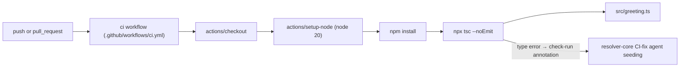

There is no multi-service architecture here — the entire "system" is one TypeScript module and the CI job that typechecks it.

`tsc`'s annotations (not a custom reporter) are the signal consumed downstream: `setup-node` registers the built-in `tsc` problem matcher, which is what turns the compiler error at `src/greeting.ts:11` into a `{path, line, message}` check-run annotation (see the comment in `.github/workflows/ci.yml:14-16`).
