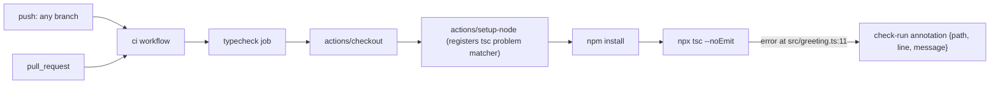

There's no service/module graph here — the only "system" is the single GitHub
Actions pipeline that turns the type error in `src/greeting.ts` into a failing
check-run.

The `setup-node` step is what converts a raw `tsc` failure into a structured
annotation (`{path, line, message}`) rather than just a red job — that
annotation is the signal the resolver-core CI-fix agent seeding consumes, per
the comment in `.github/workflows/ci.yml`.
